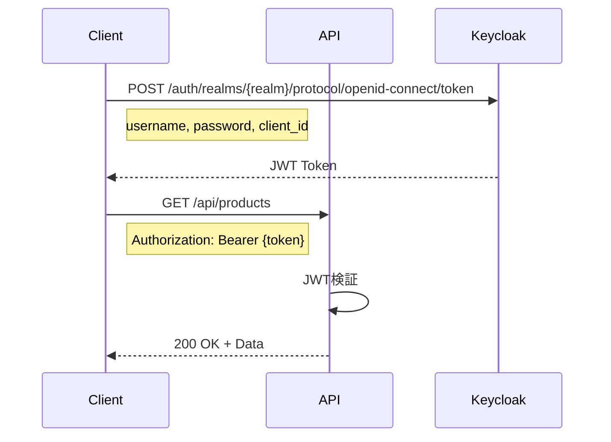

# REST API仕様書

## 目次

1. [API概要](#api概要)
2. [認証](#認証)
3. [エラーハンドリング](#エラーハンドリング)
4. [エンドポイント一覧](#エンドポイント一覧)
5. [商品管理API](#商品管理api)
6. [カテゴリ管理API](#カテゴリ管理api)
7. [ユーザー管理API](#ユーザー管理api)
8. [システムAPI](#システムapi)

## API概要

### ベースURL

```
開発環境: http://localhost:8080/api
本番環境: https://api.example.com/api
```

### 共通ヘッダー

| ヘッダー名 | 必須 | 説明 |
|-----------|------|------|
| Authorization | Yes | Bearer {JWT_TOKEN} |
| Content-Type | Yes | application/json |
| X-Request-ID | No | リクエストの追跡用ID |

### レスポンスフォーマット

成功レスポンス:
```json
{
  "data": {
    // レスポンスデータ
  },
  "meta": {
    "request_id": "550e8400-e29b-41d4-a716-446655440000",
    "timestamp": "2024-01-15T09:30:00Z"
  }
}
```

エラーレスポンス:
```json
{
  "error": {
    "code": "PRODUCT_NOT_FOUND",
    "message": "Product with ID 123 not found",
    "details": {
      // 追加のエラー情報
    }
  },
  "meta": {
    "request_id": "550e8400-e29b-41d4-a716-446655440000",
    "timestamp": "2024-01-15T09:30:00Z"
  }
}
```

## 認証

### JWT認証フロー



### トークン取得

```bash
curl -X POST "http://localhost:8081/auth/realms/rust-webapi/protocol/openid-connect/token" \
  -H "Content-Type: application/x-www-form-urlencoded" \
  -d "grant_type=password" \
  -d "client_id=api-client" \
  -d "username=testuser" \
  -d "password=password"
```

レスポンス:
```json
{
  "access_token": "eyJhbGciOiJSUzI1NiIsInR5cCIgOiAiSldUIiwia2lkIiA6...",
  "expires_in": 300,
  "refresh_expires_in": 1800,
  "refresh_token": "eyJhbGciOiJIUzI1NiIsInR5cCIgOiAiSldUIiwia2lkIiA6...",
  "token_type": "bearer",
  "scope": "profile email"
}
```

## エラーハンドリング

### HTTPステータスコード

| コード | 説明 | 使用例 |
|--------|------|--------|
| 200 | OK | 正常な取得・更新 |
| 201 | Created | リソースの作成成功 |
| 204 | No Content | 削除成功 |
| 400 | Bad Request | リクエストパラメータエラー |
| 401 | Unauthorized | 認証エラー |
| 403 | Forbidden | 権限エラー |
| 404 | Not Found | リソースが見つからない |
| 409 | Conflict | リソースの競合 |
| 422 | Unprocessable Entity | バリデーションエラー |
| 500 | Internal Server Error | サーバーエラー |

### エラーコード一覧

| エラーコード | 説明 | HTTPステータス |
|-------------|------|---------------|
| INVALID_REQUEST | リクエストフォーマットエラー | 400 |
| VALIDATION_FAILED | バリデーションエラー | 422 |
| AUTHENTICATION_FAILED | 認証失敗 | 401 |
| PERMISSION_DENIED | 権限不足 | 403 |
| RESOURCE_NOT_FOUND | リソースが見つからない | 404 |
| RESOURCE_ALREADY_EXISTS | リソースが既に存在 | 409 |
| INTERNAL_ERROR | 内部エラー | 500 |

## エンドポイント一覧

### 商品管理
- `GET /api/products` - 商品一覧取得・検索
- `POST /api/products` - 商品作成
- `GET /api/products/{id}` - 商品詳細取得
- `GET /api/products/sku/{sku}` - SKUによる商品取得
- `PUT /api/products/{id}` - 商品更新
- `PATCH /api/products/{id}` - 商品部分更新
- `DELETE /api/products/{id}` - 商品論理削除
- `DELETE /api/products/{id}/permanent` - 商品物理削除
- `POST /api/products/{id}/restore` - 商品復元
- `GET /api/products/{id}/deletion-check` - 削除可能性チェック
- `DELETE /api/products/batch` - 商品一括削除
- `GET /api/products/deleted` - 削除済み商品一覧
- `GET /api/products/{id}/history` - 商品変更履歴
- `GET /api/products/reports/low-stock` - 在庫少商品レポート
- `GET /api/products/reports/out-of-stock` - 在庫切れ商品レポート

### カテゴリ管理
- `GET /api/categories` - カテゴリ一覧取得
- `POST /api/categories` - カテゴリ作成
- `GET /api/categories/{id}` - カテゴリ詳細取得
- `PUT /api/categories/{id}` - カテゴリ更新
- `DELETE /api/categories/{id}` - カテゴリ削除

### ユーザー管理
- `GET /api/users` - ユーザー一覧取得
- `POST /api/users` - ユーザー作成
- `GET /api/users/{id}` - ユーザー詳細取得
- `PUT /api/users/{id}` - ユーザー更新
- `DELETE /api/users/{id}` - ユーザー削除

### アイテム管理
- `GET /api/items` - アイテム一覧取得
- `POST /api/items` - アイテム作成
- `GET /api/items/{id}` - アイテム詳細取得
- `PUT /api/items/{id}` - アイテム更新
- `DELETE /api/items/{id}` - アイテム削除

### 削除ログ管理
- `GET /api/deletion-logs` - 全削除ログ取得
- `GET /api/products/{id}/deletion-log` - 商品削除ログ取得

### システム
- `GET /` - ルートエンドポイント
- `GET /api/health` - ヘルスチェック
- `GET /api/metrics` - Prometheusメトリクス

## 商品管理API

### 商品一覧取得

```
GET /api/products
```

**クエリパラメータ:**

| パラメータ | 型 | 必須 | 説明 | デフォルト |
|-----------|-----|------|------|-----------|
| page | integer | No | ページ番号 | 1 |
| per_page | integer | No | 1ページあたりの件数 | 20 |
| sort | string | No | ソート項目 | created_at |
| order | string | No | ソート順 (asc/desc) | desc |
| status | string | No | ステータスフィルタ | all |
| category_id | string | No | カテゴリIDフィルタ | - |

**リクエスト例:**
```bash
curl -X GET "http://localhost:8080/api/products?page=1&per_page=10&status=active" \
  -H "Authorization: Bearer {token}"
```

**レスポンス例:**
```json
{
  "data": {
    "items": [
      {
        "id": "550e8400-e29b-41d4-a716-446655440000",
        "sku": "PROD-001",
        "name": "サンプル商品",
        "description": "これはサンプル商品です",
        "status": "active",
        "price": {
          "amount": "1980.00",
          "currency": "JPY"
        },
        "inventory": {
          "available": 100,
          "reserved": 10
        },
        "created_at": "2024-01-15T09:30:00Z",
        "updated_at": "2024-01-15T09:30:00Z"
      }
    ],
    "pagination": {
      "current_page": 1,
      "per_page": 10,
      "total_pages": 5,
      "total_items": 50
    }
  },
  "meta": {
    "request_id": "550e8400-e29b-41d4-a716-446655440000",
    "timestamp": "2024-01-15T09:30:00Z"
  }
}
```

### 商品作成

```
POST /api/products
```

**リクエストボディ:**
```json
{
  "sku": "PROD-002",
  "name": "新商品",
  "description": "新商品の説明",
  "category_ids": ["cat-001", "cat-002"],
  "price": {
    "amount": "2980.00",
    "currency": "JPY"
  },
  "initial_stock": 50,
  "attributes": {
    "color": "赤",
    "size": "M"
  }
}
```

**バリデーションルール:**
- `sku`: 必須、3-50文字、英数字とハイフン
- `name`: 必須、1-255文字
- `description`: 任意、最大1000文字
- `price.amount`: 必須、0以上
- `initial_stock`: 必須、0以上

**レスポンス例:**
```json
{
  "data": {
    "id": "550e8400-e29b-41d4-a716-446655440001",
    "sku": "PROD-002",
    "name": "新商品",
    "status": "active",
    "created_at": "2024-01-15T10:00:00Z"
  },
  "meta": {
    "request_id": "550e8400-e29b-41d4-a716-446655440000",
    "timestamp": "2024-01-15T10:00:00Z"
  }
}
```

### 商品更新

```
PUT /api/products/{id}
```

**リクエストボディ:**
```json
{
  "name": "更新された商品名",
  "description": "更新された説明",
  "status": "inactive",
  "price": {
    "amount": "3980.00",
    "currency": "JPY"
  }
}
```

**注意事項:**
- SKUは更新不可
- 在庫数は別のAPIで管理

### 商品削除（論理削除）

```
DELETE /api/products/{id}
```

**リクエストボディ:**
```json
{
  "reason": "在庫切れのため",
  "deleted_by": "user-123"
}
```

**レスポンス例:**
```json
{
  "data": {
    "message": "Product successfully deleted",
    "deletion_id": "del-550e8400-e29b-41d4"
  },
  "meta": {
    "request_id": "550e8400-e29b-41d4-a716-446655440000",
    "timestamp": "2024-01-15T10:30:00Z"
  }
}
```

### 商品復元

```
POST /api/products/{id}/restore
```

**レスポンス例:**
```json
{
  "data": {
    "id": "550e8400-e29b-41d4-a716-446655440000",
    "sku": "PROD-001",
    "name": "復元された商品",
    "status": "active",
    "restored_at": "2024-01-15T11:00:00Z"
  }
}
```

### 削除可能性チェック

```
GET /api/products/{id}/deletion-check
```

**レスポンス例:**
```json
{
  "data": {
    "can_delete": false,
    "reasons": [
      {
        "code": "ACTIVE_ORDERS",
        "message": "この商品には進行中の注文が3件あります"
      },
      {
        "code": "RESERVED_INVENTORY",
        "message": "10個の在庫が予約されています"
      }
    ],
    "force_deletable": true
  }
}
```

### バッチ削除

```
DELETE /api/products/batch
```

**リクエストボディ:**
```json
{
  "product_ids": [
    "550e8400-e29b-41d4-a716-446655440000",
    "550e8400-e29b-41d4-a716-446655440001",
    "550e8400-e29b-41d4-a716-446655440002"
  ],
  "reason": "シーズン終了",
  "force": false
}
```

**レスポンス例:**
```json
{
  "data": {
    "success_count": 2,
    "failure_count": 1,
    "results": [
      {
        "product_id": "550e8400-e29b-41d4-a716-446655440000",
        "status": "success"
      },
      {
        "product_id": "550e8400-e29b-41d4-a716-446655440001",
        "status": "success"
      },
      {
        "product_id": "550e8400-e29b-41d4-a716-446655440002",
        "status": "failed",
        "error": "Product has active orders"
      }
    ]
  }
}
```

## カテゴリ管理API

### カテゴリ一覧取得

```
GET /api/categories
```

**クエリパラメータ:**

| パラメータ | 型 | 必須 | 説明 |
|-----------|-----|------|------|
| parent_id | string | No | 親カテゴリIDでフィルタ |
| depth | integer | No | 階層の深さ（1-5） |

**レスポンス例:**
```json
{
  "data": {
    "categories": [
      {
        "id": "cat-001",
        "name": "電化製品",
        "slug": "electronics",
        "parent_id": null,
        "path": "/electronics",
        "children": [
          {
            "id": "cat-002",
            "name": "スマートフォン",
            "slug": "smartphones",
            "parent_id": "cat-001",
            "path": "/electronics/smartphones"
          }
        ]
      }
    ]
  }
}
```

### カテゴリ作成

```
POST /api/categories
```

**リクエストボディ:**
```json
{
  "name": "タブレット",
  "slug": "tablets",
  "parent_id": "cat-001",
  "description": "タブレット端末カテゴリ",
  "meta": {
    "keywords": ["タブレット", "iPad", "Android"],
    "display_order": 2
  }
}
```

## ユーザー管理API

### ユーザー一覧取得

```
GET /api/users
```

**クエリパラメータ:**

| パラメータ | 型 | 必須 | 説明 |
|-----------|-----|------|------|
| role | string | No | ロールでフィルタ |
| status | string | No | ステータスでフィルタ |
| search | string | No | 名前/メールで検索 |

### ユーザー作成

```
POST /api/users
```

**リクエストボディ:**
```json
{
  "username": "newuser",
  "email": "newuser@example.com",
  "password": "SecurePassword123!",
  "role": "customer",
  "profile": {
    "first_name": "太郎",
    "last_name": "山田",
    "phone": "090-1234-5678"
  }
}
```

## システムAPI

### ヘルスチェック

```
GET /api/health
```

**レスポンス例:**
```json
{
  "status": "healthy",
  "version": "1.0.0",
  "checks": {
    "database": {
      "status": "up",
      "latency_ms": 5
    },
    "cache": {
      "status": "up",
      "latency_ms": 1
    },
    "auth": {
      "status": "up",
      "latency_ms": 15
    }
  },
  "timestamp": "2024-01-15T12:00:00Z"
}
```

### メトリクス

```
GET /api/metrics
```

Prometheusフォーマットでメトリクスを返します：

```
# HELP http_requests_total Total number of HTTP requests
# TYPE http_requests_total counter
http_requests_total{method="GET",endpoint="/api/products",status="200"} 1234

# HELP http_request_duration_seconds HTTP request duration
# TYPE http_request_duration_seconds histogram
http_request_duration_seconds_bucket{le="0.1"} 1000
http_request_duration_seconds_bucket{le="0.5"} 1200
http_request_duration_seconds_bucket{le="1.0"} 1234
```

## レート制限

APIにはレート制限が適用されています：

| エンドポイント | 制限 |
|--------------|------|
| 認証API | 5 req/min |
| 読み取りAPI | 100 req/min |
| 書き込みAPI | 30 req/min |

制限を超えた場合、`429 Too Many Requests`が返されます：

```json
{
  "error": {
    "code": "RATE_LIMIT_EXCEEDED",
    "message": "Rate limit exceeded. Please try again later.",
    "retry_after": 60
  }
}
```

## WebSocket API（将来実装予定）

リアルタイム更新用のWebSocket APIエンドポイント：

```
ws://localhost:8080/api/ws
```

接続後、以下のイベントをサブスクライブ可能：
- `product.created`
- `product.updated`
- `product.deleted`
- `inventory.changed`
- `order.placed`