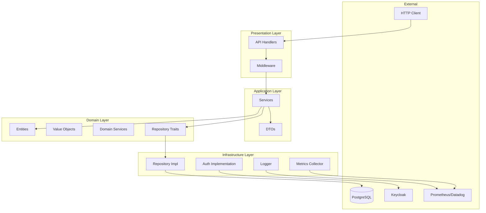
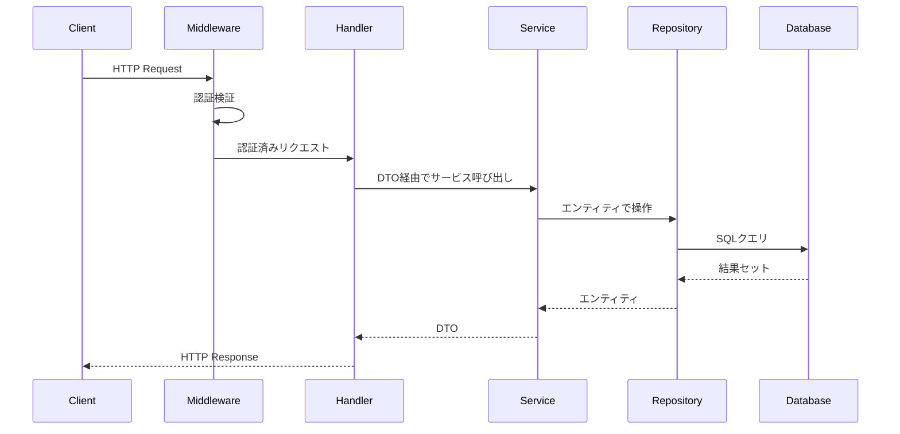

# アーキテクチャ詳細設計書

## 目次

1. [アーキテクチャ概要](#アーキテクチャ概要)
2. [レイヤー設計](#レイヤー設計)
3. [コンポーネント詳細](#コンポーネント詳細)
4. [データフロー](#データフロー)
5. [設計パターン](#設計パターン)
6. [エラー処理](#エラー処理)
7. [非同期処理](#非同期処理)
8. [依存性注入](#依存性注入)

## アーキテクチャ概要

本システムは、ドメイン駆動設計（DDD）とクリーンアーキテクチャの原則に基づいて設計されています。

### アーキテクチャ図



## レイヤー設計

### 1. ドメイン層 (Domain Layer)

**責務**: ビジネスロジックとビジネスルールの実装

**主要コンポーネント**:

#### エンティティ (Entities)
```rust
// src/app_domain/model/product.rs
#[derive(Debug, Clone)]
pub struct Product {
    pub id: ProductId,
    pub sku: Sku,
    pub name: ProductName,
    pub description: Option<Description>,
    pub status: ProductStatus,
    pub created_at: DateTime<Utc>,
    pub updated_at: DateTime<Utc>,
}

impl Product {
    pub fn new(sku: Sku, name: ProductName) -> Self {
        // ビジネスルールの実装
    }
    
    pub fn can_be_deleted(&self) -> Result<(), DomainError> {
        // 削除可能性のビジネスルール検証
    }
}
```

#### 値オブジェクト (Value Objects)
```rust
#[derive(Debug, Clone, PartialEq)]
pub struct Sku(String);

impl Sku {
    pub fn new(value: String) -> Result<Self, DomainError> {
        // SKUフォーマットの検証
        if value.len() < 3 || value.len() > 50 {
            return Err(DomainError::InvalidSku);
        }
        Ok(Self(value))
    }
}
```

#### リポジトリインターフェース (Repository Traits)
```rust
#[async_trait]
pub trait ProductRepository: Send + Sync {
    async fn find_by_id(&self, id: &ProductId) -> Result<Option<Product>>;
    async fn find_by_sku(&self, sku: &Sku) -> Result<Option<Product>>;
    async fn save(&self, product: &Product) -> Result<()>;
    async fn delete(&self, id: &ProductId) -> Result<()>;
}
```

### 2. アプリケーション層 (Application Layer)

**責務**: ユースケースの実装、トランザクション管理、DTO変換

**主要コンポーネント**:

#### サービス (Services)
```rust
// src/application/service/product_service.rs
pub struct ProductService {
    product_repo: Arc<dyn ProductRepository>,
    inventory_repo: Arc<dyn InventoryRepository>,
    event_publisher: Arc<dyn EventPublisher>,
}

impl ProductService {
    pub async fn create_product(&self, dto: CreateProductDto) -> Result<ProductDto> {
        // トランザクション開始
        let product = Product::new(
            Sku::new(dto.sku)?,
            ProductName::new(dto.name)?
        );
        
        // リポジトリ経由で保存
        self.product_repo.save(&product).await?;
        
        // イベント発行
        self.event_publisher.publish(ProductCreated {
            product_id: product.id.clone(),
        }).await?;
        
        Ok(ProductDto::from(product))
    }
}
```

#### DTO (Data Transfer Objects)
```rust
#[derive(Serialize, Deserialize)]
pub struct CreateProductDto {
    pub sku: String,
    pub name: String,
    pub description: Option<String>,
    pub initial_stock: u32,
    pub price: Decimal,
}

#[derive(Serialize, Deserialize)]
pub struct ProductDto {
    pub id: String,
    pub sku: String,
    pub name: String,
    pub status: String,
    pub created_at: String,
}
```

### 3. インフラストラクチャ層 (Infrastructure Layer)

**責務**: 技術的な実装詳細、外部システムとの統合

**主要コンポーネント**:

#### リポジトリ実装
```rust
// src/infrastructure/repository/product_repository.rs
pub struct PostgresProductRepository {
    pool: Arc<PgPool>,
}

#[async_trait]
impl ProductRepository for PostgresProductRepository {
    async fn find_by_id(&self, id: &ProductId) -> Result<Option<Product>> {
        let row = sqlx::query!(
            r#"
            SELECT id, sku, name, description, status, created_at, updated_at
            FROM products
            WHERE id = $1 AND deleted_at IS NULL
            "#,
            id.to_string()
        )
        .fetch_optional(&*self.pool)
        .await?;
        
        Ok(row.map(|r| Product::from_row(r)))
    }
}
```

#### 認証実装
```rust
// src/infrastructure/auth/keycloak.rs
pub struct KeycloakAuth {
    client: reqwest::Client,
    config: KeycloakConfig,
}

impl KeycloakAuth {
    pub async fn validate_token(&self, token: &str) -> Result<Claims> {
        // JWT検証ロジック
    }
}
```

### 4. プレゼンテーション層 (Presentation Layer)

**責務**: HTTPリクエスト/レスポンスの処理、ルーティング

**主要コンポーネント**:

#### APIハンドラー
```rust
// src/presentation/api/product_handler.rs
pub struct ProductHandler {
    service: Arc<ProductService>,
}

impl ProductHandler {
    pub async fn create_product(
        &self,
        req: HttpRequest,
        payload: web::Json<CreateProductDto>,
    ) -> Result<HttpResponse, ApiError> {
        let user_id = extract_user_id(&req)?;
        
        let product = self.service
            .create_product(payload.into_inner())
            .await
            .map_err(|e| ApiError::from(e))?;
        
        Ok(HttpResponse::Created().json(product))
    }
}
```

## データフロー

### リクエスト処理フロー



## 設計パターン

### 1. リポジトリパターン

データアクセスの抽象化により、ビジネスロジックをインフラストラクチャから分離：

```rust
// トレイト定義（ドメイン層）
pub trait Repository<T, ID> {
    async fn find_by_id(&self, id: &ID) -> Result<Option<T>>;
    async fn save(&self, entity: &T) -> Result<()>;
    async fn delete(&self, id: &ID) -> Result<()>;
}

// 実装（インフラストラクチャ層）
impl Repository<Product, ProductId> for PostgresProductRepository {
    // 実装詳細
}
```

### 2. ファクトリーパターン

複雑なオブジェクトの生成ロジックをカプセル化：

```rust
pub struct ProductFactory;

impl ProductFactory {
    pub fn create_with_inventory(
        sku: Sku,
        name: ProductName,
        initial_stock: u32,
    ) -> Result<(Product, Inventory)> {
        let product = Product::new(sku, name);
        let inventory = Inventory::new(product.id.clone(), initial_stock);
        Ok((product, inventory))
    }
}
```

### 3. 戦略パターン

価格計算などの可変アルゴリズムの実装：

```rust
pub trait PricingStrategy: Send + Sync {
    async fn calculate_price(&self, product: &Product, quantity: u32) -> Decimal;
}

pub struct StandardPricingStrategy;
pub struct VolumePricingStrategy;
pub struct TimePricingStrategy;
```

### 4. デコレーターパターン

ミドルウェアによる機能の追加：

```rust
pub struct LoggingMiddleware<S> {
    service: S,
}

impl<S> Service<ServiceRequest> for LoggingMiddleware<S>
where
    S: Service<ServiceRequest>,
{
    // リクエスト/レスポンスのログ記録
}
```

## エラー処理

### エラー階層

```rust
// ドメインエラー
#[derive(Debug, thiserror::Error)]
pub enum DomainError {
    #[error("Invalid SKU format")]
    InvalidSku,
    #[error("Product not found")]
    ProductNotFound,
    #[error("Insufficient inventory")]
    InsufficientInventory,
}

// アプリケーションエラー
#[derive(Debug, thiserror::Error)]
pub enum ApplicationError {
    #[error("Domain error: {0}")]
    Domain(#[from] DomainError),
    #[error("Repository error: {0}")]
    Repository(#[from] RepositoryError),
    #[error("Transaction failed")]
    TransactionFailed,
}

// APIエラー
#[derive(Debug, thiserror::Error)]
pub enum ApiError {
    #[error("Bad request: {0}")]
    BadRequest(String),
    #[error("Unauthorized")]
    Unauthorized,
    #[error("Not found")]
    NotFound,
    #[error("Internal server error")]
    InternalError,
}
```

### エラー変換

```rust
impl From<ApplicationError> for ApiError {
    fn from(err: ApplicationError) -> Self {
        match err {
            ApplicationError::Domain(DomainError::ProductNotFound) => ApiError::NotFound,
            ApplicationError::Domain(_) => ApiError::BadRequest(err.to_string()),
            _ => ApiError::InternalError,
        }
    }
}
```

## 非同期処理

### Tokioランタイム

```rust
#[actix_web::main]
async fn main() -> std::io::Result<()> {
    // Tokioランタイムの初期化
    let runtime = tokio::runtime::Builder::new_multi_thread()
        .worker_threads(4)
        .enable_all()
        .build()?;
}
```

### 並行処理

```rust
pub async fn batch_delete_products(
    &self,
    product_ids: Vec<ProductId>,
) -> Result<Vec<Result<()>>> {
    let futures = product_ids
        .into_iter()
        .map(|id| self.delete_product(id));
    
    // 並行実行
    let results = futures::future::join_all(futures).await;
    Ok(results)
}
```

## 依存性注入

### アプリケーション状態

```rust
pub struct AppState {
    pub product_service: Arc<ProductService>,
    pub user_service: Arc<UserService>,
    pub auth_service: Arc<dyn AuthService>,
}

impl AppState {
    pub fn new(config: Config) -> Self {
        // 依存関係の構築
        let db_pool = create_db_pool(&config.database_url);
        let product_repo = Arc::new(PostgresProductRepository::new(db_pool.clone()));
        let product_service = Arc::new(ProductService::new(product_repo));
        
        Self {
            product_service,
            // ...
        }
    }
}
```

### ルーティングへの注入

```rust
pub fn configure_routes(cfg: &mut web::ServiceConfig) {
    cfg.app_data(web::Data::new(app_state))
        .service(
            web::scope("/api")
                .configure(configure_product_routes)
                .configure(configure_user_routes)
        );
}
```

## パフォーマンス最適化

### コネクションプーリング

```rust
pub fn create_db_pool(database_url: &str) -> PgPool {
    PgPoolOptions::new()
        .max_connections(32)
        .min_connections(5)
        .connect_timeout(Duration::from_secs(30))
        .idle_timeout(Duration::from_secs(600))
        .connect(database_url)
        .await
        .expect("Failed to create pool")
}
```

### キャッシング戦略

```rust
pub struct CachedProductRepository {
    inner: Arc<dyn ProductRepository>,
    cache: Arc<RwLock<HashMap<ProductId, (Product, Instant)>>>,
    ttl: Duration,
}
```

## セキュリティ考慮事項

### 入力検証

すべての入力は値オブジェクトで検証：

```rust
impl ProductName {
    pub fn new(value: String) -> Result<Self, DomainError> {
        let trimmed = value.trim();
        if trimmed.is_empty() || trimmed.len() > 255 {
            return Err(DomainError::InvalidProductName);
        }
        // XSS対策などの追加検証
        Ok(Self(trimmed.to_string()))
    }
}
```

### SQLインジェクション対策

SQLxのプリペアドステートメントを使用：

```rust
sqlx::query!(
    "SELECT * FROM products WHERE id = $1",
    product_id  // 自動的にエスケープされる
)
```