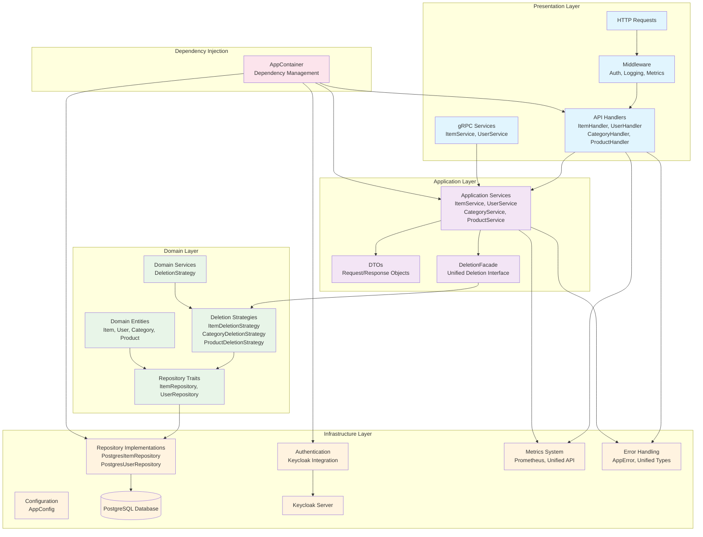

# アーキテクチャガイド

このドキュメントでは、Rust WebAPI のアーキテクチャ設計について説明します。

## 目次

- [全体像](#全体像)
- [アーキテクチャ層](#アーキテクチャ層)
- [主要コンポーネント](#主要コンポーネント)
- [データフロー](#データフロー)
- [認証機構](#認証機構)
- [可観測性](#可観測性)
- [最新の実装改善](#最新の実装改善)

## 全体像

このプロジェクトはドメイン駆動設計（DDD）の原則に基づいた多層アーキテクチャを採用しています。これにより、ビジネスロジックとインフラストラクチャの関心事を分離し、テスト容易性と保守性を高めています。



## アーキテクチャ層

### 1. ドメイン層 (`crates/domain/` および `src/app_domain/`)

ドメイン層はビジネスロジックの中核を担い、以下のコンポーネントで構成されています：

- **エンティティ**: ビジネスの中心的なオブジェクト（`Item`, `User`, `Category`, `Product`）
- **値オブジェクト**: 不変の値を表現（`Email`, `Password` など）
- **リポジトリインターフェース**: データアクセスの抽象化（トレイト）
- **ドメインサービス**: エンティティを跨ぐロジック
- **削除戦略**: 統一された削除操作の実装（`DeletionStrategy`）

この層はデータベースやフレームワークに依存せず、純粋なRustコードで実装されています。

### 2. アプリケーション層 (`src/application/`)

アプリケーション層はユースケースを実装し、ドメイン層とプレゼンテーション層を仲介します：

- **DTOs（Data Transfer Objects）**: API通信用のデータ構造
- **サービス**: ユースケースの実装
- **ファサード**: 複数ドメインサービスの統一インターフェース（`DeletionFacade`）
- **バリデーション**: 入力データの検証
- **例外処理**: エラーハンドリングの統一

この層はドメインオブジェクトとDTOの変換、トランザクション管理などを担当します。

### 3. インフラストラクチャ層 (`src/infrastructure/`)

インフラストラクチャ層は外部システムとの連携を担当します：

- **リポジトリ実装**: PostgreSQLを使用したデータアクセス
- **認証**: Keycloakを使用したJWT認証
- **ロギング**: `tracing` を使用した構造化ログ
- **メトリクス**: 統一されたPrometheusメトリクス収集システム
- **エラー処理**: 統一されたエラー型（`AppError`）
- **設定管理**: 環境変数とコンフィグファイルの管理
- **依存性注入**: アプリケーション全体の依存関係管理（`AppContainer`）

この層は具体的な技術選択を含み、ドメイン層をインフラストラクチャから隔離します。

### 4. プレゼンテーション層 (`src/presentation/`)

プレゼンテーション層はAPIのエンドポイントとHTTPインターフェースを提供します：

- **ハンドラ**: HTTPリクエスト/レスポンスの処理
- **ルート定義**: APIエンドポイントのマッピング
- **ミドルウェア**: 認証、ロギング、エラーハンドリング
- **シリアライゼーション**: JSON形式の変換
- **gRPCサービス**: Protocol Buffersを使用したgRPC API

この層は`actix-web`を使用してRESTful APIと`tonic`を使用してgRPC APIを実装しています。

## 主要コンポーネント

### 依存性注入コンテナ

`AppContainer`は全アプリケーションの依存関係を管理し、以下の責務を持ちます：

- Repository、Service、Handlerのライフサイクル管理
- 設定の注入
- 依存関係の自動解決

```rust
pub struct AppContainer {
    pub item_handler: web::Data<ItemHandler>,
    pub user_handler: web::Data<UserHandler>,
    pub category_handler: web::Data<CategoryHandler>,
    pub product_handler: web::Data<ProductHandler>,
    // ... その他のコンポーネント
}
```

### 削除操作の統一

削除操作は戦略パターンとファサードパターンを使用して統一されています：

- **DeletionStrategy**: 各エンティティタイプの削除戦略を定義
- **DeletionFacade**: 複数の削除戦略を統一インターフェースで提供
- **DeleteKind**: 論理削除、物理削除、復元の操作種別

```rust
pub trait DeletionStrategy {
    async fn delete(&self, id: &str, kind: DeleteKind) -> Result<(), DeletionError>;
}
```

### エラー処理の統一

全レイヤで統一されたエラー型を使用：

```rust
pub enum AppError {
    NotFound(String),
    BadRequest(String),
    Unauthorized(String),
    InternalError(String),
    // ... その他のエラー型
}
```

### メトリクス記録の統一

統一されたメトリクスAPIを提供：

```rust
// 高レベルAPI
Metrics::with_metrics("service", "operation", async { /* ... */ }).await

// 個別記録
Metrics::record_success("service", "operation");
Metrics::record_error("service", "operation");
```

### リポジトリ

リポジトリはドメイン層でインターフェース（トレイト）として定義され、インフラストラクチャ層で実装されています：

- `domain::repository::ItemRepository`（トレイト）
- `infrastructure::repository::PostgresItemRepository`（実装）

### サービス

サービスはアプリケーション層にあり、ドメインロジックを協調させてユースケースを実装します：

- `application::service::ItemService`
- `application::service::UserService`
- `application::service::CategoryService`
- `application::service::ProductService`

### APIハンドラ

ハンドラはプレゼンテーション層にあり、HTTPリクエストを処理してサービスを呼び出します：

- `presentation::api::ItemHandler`
- `presentation::api::UserHandler`
- `presentation::api::CategoryHandler`
- `presentation::api::ProductHandler`

## データフロー

1. HTTPリクエストがプレゼンテーション層のハンドラに到達
2. ハンドラはリクエストをDTOに変換
3. DTOがアプリケーション層のサービスに渡される
4. サービスはドメインオブジェクトへの変換を行い、ドメインロジックを実行
5. 削除操作の場合、DeletionFacadeを通じて適切な削除戦略が実行される
6. データアクセスが必要な場合、リポジトリインターフェースを介してインフラストラクチャ層と連携
7. 結果がドメインオブジェクトからDTOに変換され、クライアントに返される
8. メトリクスが自動的に記録され、エラーが発生した場合は統一されたエラー形式で返される

## 認証機構

認証はKeycloakと連携したJWTベースの認証を実装しています：

- `infrastructure::auth::keycloak::KeycloakAuth`: Keycloakとの連携
- `infrastructure::auth::middleware`: 認証ミドルウェア

認証フローは以下の通りです：

1. クライアントはKeycloakから認証トークン（JWT）を取得
2. APIリクエストにJWTトークンを付与
3. 認証ミドルウェアがトークンを検証
4. 認証済みユーザー情報がリクエストコンテキストに追加
5. 各ハンドラは必要に応じて認可チェックを実行

## 可観測性

アプリケーションは包括的な可観測性機能を備えています：

- **ロギング**: `tracing`による構造化JSONログ
- **メトリクス**: 統一されたPrometheusメトリクス（`/api/metrics`エンドポイント）
- **トレーシング**: OpenTelemetryによる分散トレーシング

メトリクスは以下の形式で自動収集されます：
- リクエスト成功/失敗カウント
- レスポンス時間
- エラー率

詳細な可観測性の実装については、[o11y.md](../o11y.md)を参照してください。

## 最新の実装改善

### Phase 2-1: 依存性注入コンテナ（完了）
- `AppContainer`による依存関係の自動管理
- main.rsの簡素化（76行に削減）
- 設定の注入とライフサイクル管理

### Phase 2-3: 削除操作の統一（完了）
- 戦略パターンによる削除方法の抽象化
- ファサードパターンによる統一インターフェース
- 論理削除、物理削除、復元の統一処理

### Phase 3-2: エラー処理の統一（完了）
- `AppError`による全レイヤでの統一エラー型
- unwrap/expectの完全除去
- JSONエラーレスポンスの標準化

### Phase 3-3: メトリクス記録の統一（完了）
- 統一されたメトリクスAPIの実装
- 自動的な成功/失敗記録
- 重複コードの削除と保守性向上

これらの改善により、コードの保守性、テスト容易性、運用性が大幅に向上しています。
