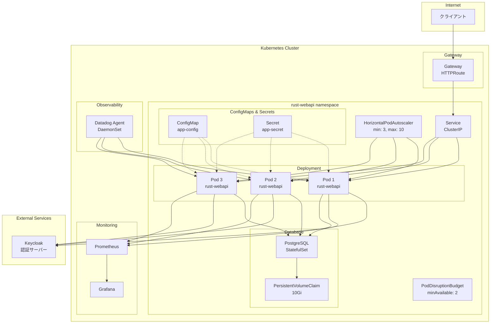
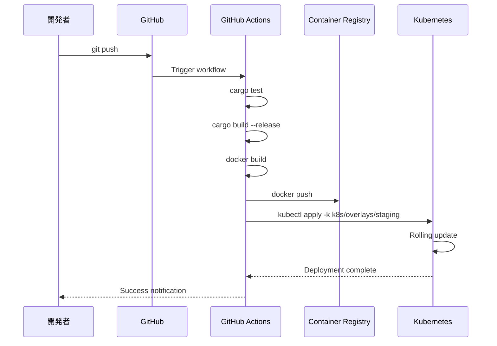
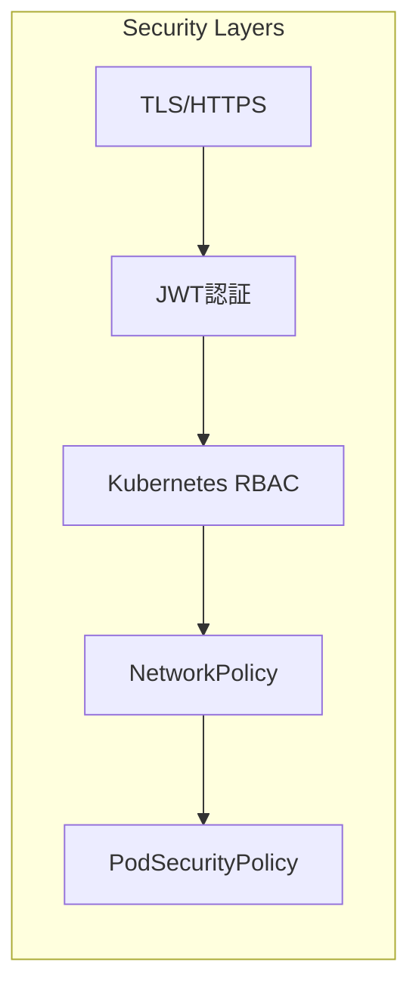

# デプロイメント図

## Kubernetes構成



## コンポーネント説明

### アプリケーション層
- **Pods**: rust-webapiコンテナを実行
  - 最小3レプリカ、最大10レプリカ
  - リソース制限: CPU 500m, Memory 512Mi
  - ヘルスチェック: /api/health

### ネットワーク層
- **Gateway**: 外部からのHTTPSトラフィックを受信
- **Service**: ClusterIPでPod間の負荷分散
- **NetworkPolicy**: 必要な通信のみ許可

### データ層
- **PostgreSQL**: StatefulSetで実行
- **PersistentVolume**: 10GiBのストレージ

### 監視・観測性
- **Prometheus**: メトリクス収集
- **Grafana**: メトリクス可視化
- **Datadog**: APM、ログ、メトリクス統合監視

### 外部サービス
- **Keycloak**: OAuth2/OIDC認証プロバイダー

## デプロイメントフロー



## 環境別設定

### Development
```yaml
replicas: 1
resources:
  limits:
    cpu: 200m
    memory: 256Mi
database:
  size: 1Gi
```

### Staging
```yaml
replicas: 2
resources:
  limits:
    cpu: 500m
    memory: 512Mi
database:
  size: 5Gi
```

### Production
```yaml
replicas: 3-10 (HPA)
resources:
  limits:
    cpu: 1000m
    memory: 1Gi
database:
  size: 50Gi
  backup: enabled
```

## セキュリティ設定



### セキュリティポリシー
- すべての通信はTLS暗号化
- JWT認証必須（ヘルスチェック除く）
- 最小権限の原則（RBAC）
- ネットワーク分離（NetworkPolicy）
- コンテナセキュリティ（非root実行） 