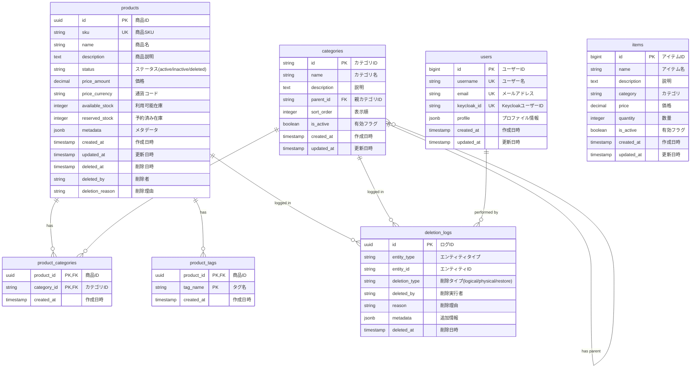

# エンティティ関係図（ER図）

## データベーススキーマ



## リレーションシップの説明

### 商品関連
- **products ↔ categories**: 多対多の関係（product_categories経由）
- **products ↔ tags**: 多対多の関係（product_tags経由）
- **products → deletion_logs**: 削除操作のログ

### カテゴリ関連
- **categories → categories**: 自己参照（階層構造）
- **categories → deletion_logs**: 削除操作のログ

### ユーザー関連
- **users → deletion_logs**: 削除操作の実行者

### 削除ログ
- **deletion_logs**: 全エンティティの削除操作を記録
  - entity_typeとentity_idで対象を特定
  - 論理削除、物理削除、復元の履歴を保持

## インデックス

```sql
-- 商品検索用
CREATE INDEX idx_products_sku ON products(sku);
CREATE INDEX idx_products_status ON products(status);
CREATE INDEX idx_products_created_at ON products(created_at DESC);

-- カテゴリ検索用
CREATE INDEX idx_categories_parent_id ON categories(parent_id);
CREATE INDEX idx_categories_is_active ON categories(is_active);

-- 関連テーブル
CREATE INDEX idx_product_categories_product_id ON product_categories(product_id);
CREATE INDEX idx_product_categories_category_id ON product_categories(category_id);
CREATE INDEX idx_product_tags_product_id ON product_tags(product_id);

-- 削除ログ検索用
CREATE INDEX idx_deletion_logs_entity ON deletion_logs(entity_type, entity_id);
CREATE INDEX idx_deletion_logs_deleted_at ON deletion_logs(deleted_at DESC);
```

## 制約

```sql
-- 外部キー制約
ALTER TABLE product_categories 
  ADD CONSTRAINT fk_product_categories_product 
  FOREIGN KEY (product_id) REFERENCES products(id) ON DELETE CASCADE;

ALTER TABLE product_categories 
  ADD CONSTRAINT fk_product_categories_category 
  FOREIGN KEY (category_id) REFERENCES categories(id) ON DELETE CASCADE;

ALTER TABLE categories 
  ADD CONSTRAINT fk_categories_parent 
  FOREIGN KEY (parent_id) REFERENCES categories(id) ON DELETE SET NULL;

-- チェック制約
ALTER TABLE products 
  ADD CONSTRAINT chk_products_status 
  CHECK (status IN ('active', 'inactive', 'deleted'));

ALTER TABLE products 
  ADD CONSTRAINT chk_products_price 
  CHECK (price_amount >= 0);

ALTER TABLE products 
  ADD CONSTRAINT chk_products_stock 
  CHECK (available_stock >= 0 AND reserved_stock >= 0);
``` 