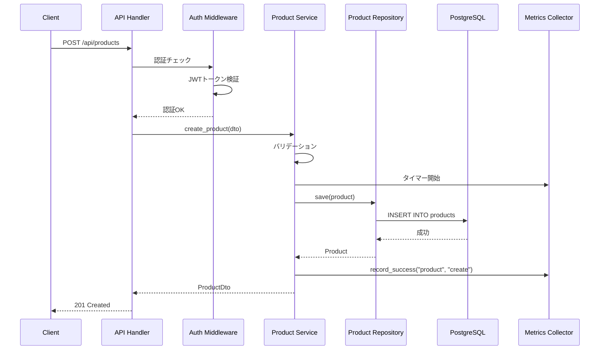
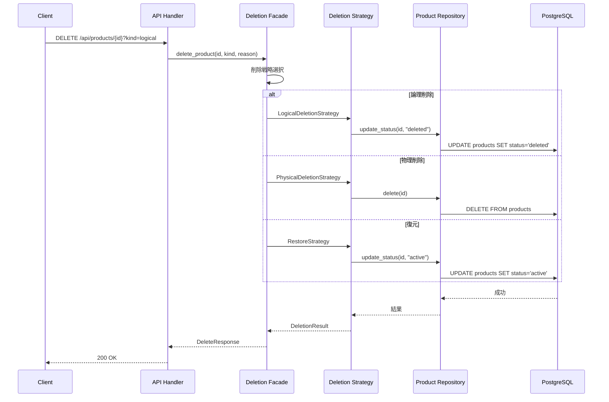
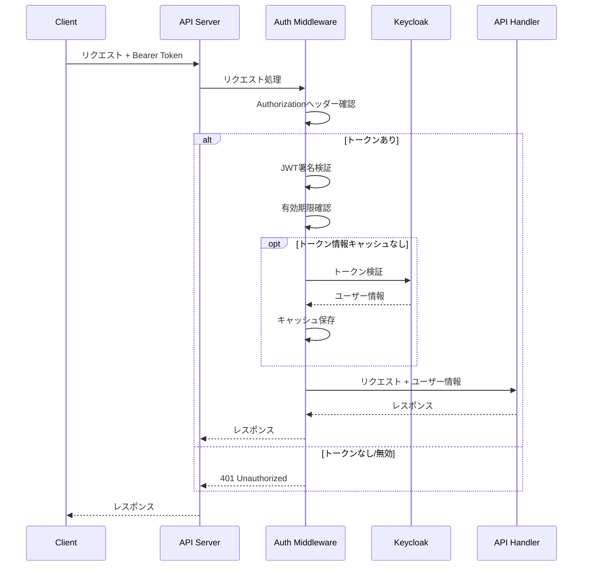
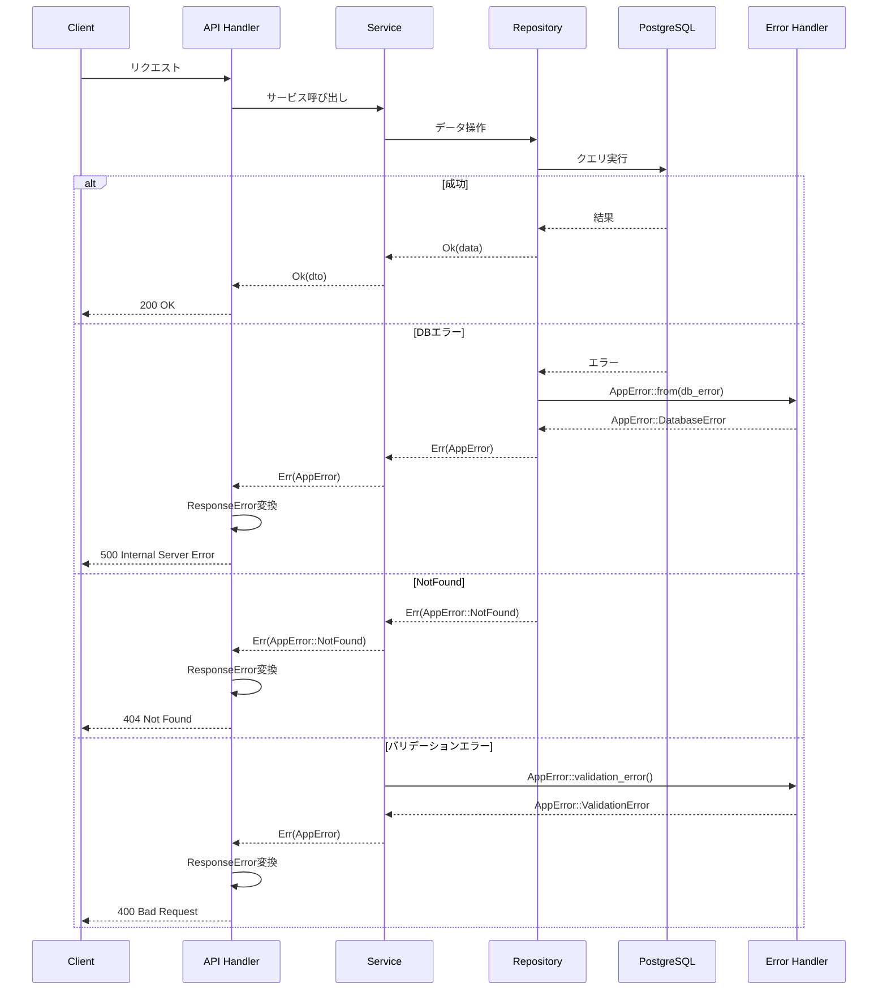
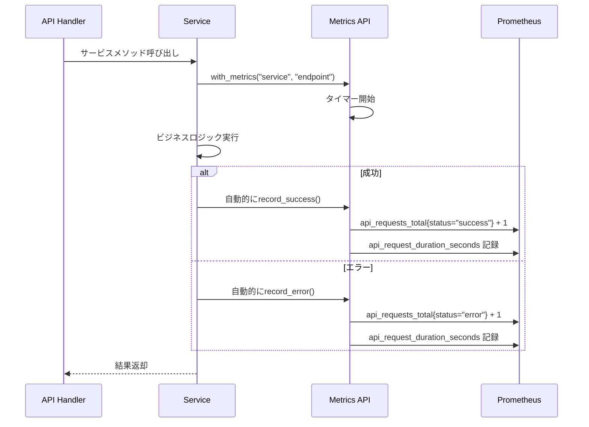
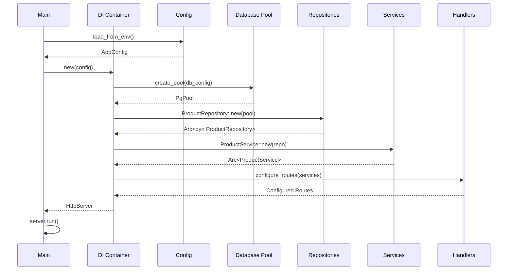

# シーケンス図

## 1. 商品作成フロー

```mermaid
sequenceDiagram
    participant Client
    participant API as API Handler
    participant Auth as Auth Middleware
    participant Service as Product Service
    participant Repo as Product Repository
    participant DB as PostgreSQL
    participant Metrics as Metrics Collector

    Client->>API: POST /api/products
    API->>Auth: 認証チェック
    Auth->>Auth: JWTトークン検証
    Auth-->>API: 認証OK
    
    API->>Service: create_product(dto)
    Service->>Service: バリデーション
    
    Service->>Metrics: タイマー開始
    Service->>Repo: save(product)
    Repo->>DB: INSERT INTO products
    DB-->>Repo: 成功
    Repo-->>Service: Product
    
    Service->>Metrics: record_success("product", "create")
    Service-->>API: ProductDto
    
    API-->>Client: 201 Created
```

## 2. 商品削除フロー（統一削除インターフェース）

```mermaid
sequenceDiagram
    participant Client
    participant API as API Handler
    participant Service as Deletion Facade
    participant Strategy as Deletion Strategy
    participant Repo as Product Repository
    participant DB as PostgreSQL

    Client->>API: DELETE /api/products/{id}?kind=logical
    API->>Service: delete_product(id, kind, reason)
    
    Service->>Service: 削除戦略選択
    
    alt 論理削除
        Service->>Strategy: LogicalDeletionStrategy
        Strategy->>Repo: update_status(id, "deleted")
        Repo->>DB: UPDATE products SET status='deleted'
    else 物理削除
        Service->>Strategy: PhysicalDeletionStrategy
        Strategy->>Repo: delete(id)
        Repo->>DB: DELETE FROM products
    else 復元
        Service->>Strategy: RestoreStrategy
        Strategy->>Repo: update_status(id, "active")
        Repo->>DB: UPDATE products SET status='active'
    end
    
    DB-->>Repo: 成功
    Repo-->>Strategy: 結果
    Strategy-->>Service: DeletionResult
    Service-->>API: DeleteResponse
    API-->>Client: 200 OK
```

## 3. 認証フロー

```mermaid
sequenceDiagram
    participant Client
    participant API as API Server
    participant Auth as Auth Middleware
    participant Keycloak
    participant Handler as API Handler

    Client->>API: リクエスト + Bearer Token
    API->>Auth: リクエスト処理
    
    Auth->>Auth: Authorizationヘッダー確認
    
    alt トークンあり
        Auth->>Auth: JWT署名検証
        Auth->>Auth: 有効期限確認
        
        opt トークン情報キャッシュなし
            Auth->>Keycloak: トークン検証
            Keycloak-->>Auth: ユーザー情報
            Auth->>Auth: キャッシュ保存
        end
        
        Auth->>Handler: リクエスト + ユーザー情報
        Handler-->>Auth: レスポンス
        Auth-->>API: レスポンス
    else トークンなし/無効
        Auth-->>API: 401 Unauthorized
    end
    
    API-->>Client: レスポンス
```

## 4. エラーハンドリングフロー

```mermaid
sequenceDiagram
    participant Client
    participant API as API Handler
    participant Service
    participant Repository
    participant DB as PostgreSQL
    participant Error as Error Handler

    Client->>API: リクエスト
    API->>Service: サービス呼び出し
    Service->>Repository: データ操作
    Repository->>DB: クエリ実行
    
    alt 成功
        DB-->>Repository: 結果
        Repository-->>Service: Ok(data)
        Service-->>API: Ok(dto)
        API-->>Client: 200 OK
    else DBエラー
        DB-->>Repository: エラー
        Repository->>Error: AppError::from(db_error)
        Error-->>Repository: AppError::DatabaseError
        Repository-->>Service: Err(AppError)
        Service-->>API: Err(AppError)
        API->>API: ResponseError変換
        API-->>Client: 500 Internal Server Error
    else NotFound
        Repository-->>Service: Err(AppError::NotFound)
        Service-->>API: Err(AppError::NotFound)
        API->>API: ResponseError変換
        API-->>Client: 404 Not Found
    else バリデーションエラー
        Service->>Error: AppError::validation_error()
        Error-->>Service: AppError::ValidationError
        Service-->>API: Err(AppError)
        API->>API: ResponseError変換
        API-->>Client: 400 Bad Request
    end
```

## 5. メトリクス記録フロー

```mermaid
sequenceDiagram
    participant Handler as API Handler
    participant Service
    participant Metrics as Metrics API
    participant Prometheus

    Handler->>Service: サービスメソッド呼び出し
    
    Service->>Metrics: with_metrics("service", "endpoint")
    Metrics->>Metrics: タイマー開始
    
    Service->>Service: ビジネスロジック実行
    
    alt 成功
        Service->>Metrics: 自動的にrecord_success()
        Metrics->>Prometheus: api_requests_total{status="success"} + 1
        Metrics->>Prometheus: api_request_duration_seconds 記録
    else エラー
        Service->>Metrics: 自動的にrecord_error()
        Metrics->>Prometheus: api_requests_total{status="error"} + 1
        Metrics->>Prometheus: api_request_duration_seconds 記録
    end
    
    Service-->>Handler: 結果返却
```

## 6. 依存性注入フロー

```mermaid
sequenceDiagram
    participant Main
    participant Container as DI Container
    participant Config
    participant DB as Database Pool
    participant Repos as Repositories
    participant Services
    participant Handlers

    Main->>Config: load_from_env()
    Config-->>Main: AppConfig
    
    Main->>Container: new(config)
    Container->>DB: create_pool(db_config)
    DB-->>Container: PgPool
    
    Container->>Repos: ProductRepository::new(pool)
    Repos-->>Container: Arc<dyn ProductRepository>
    
    Container->>Services: ProductService::new(repo)
    Services-->>Container: Arc<ProductService>
    
    Container->>Handlers: configure_routes(services)
    Handlers-->>Container: Configured Routes
    
    Container-->>Main: HttpServer
    Main->>Main: server.run()
``` 